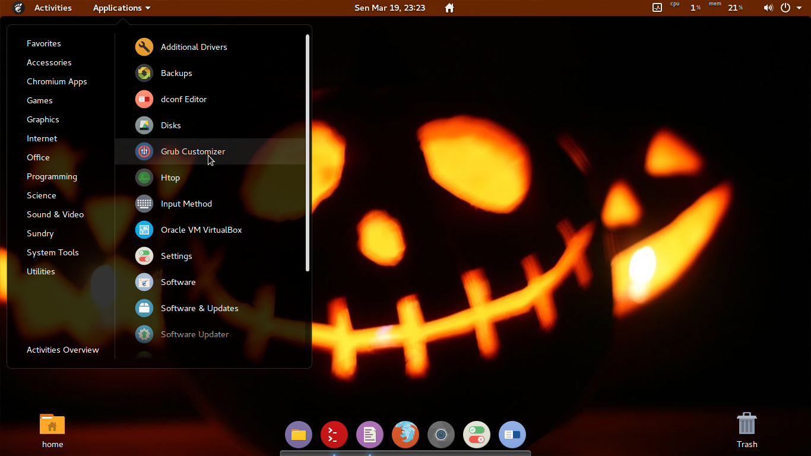
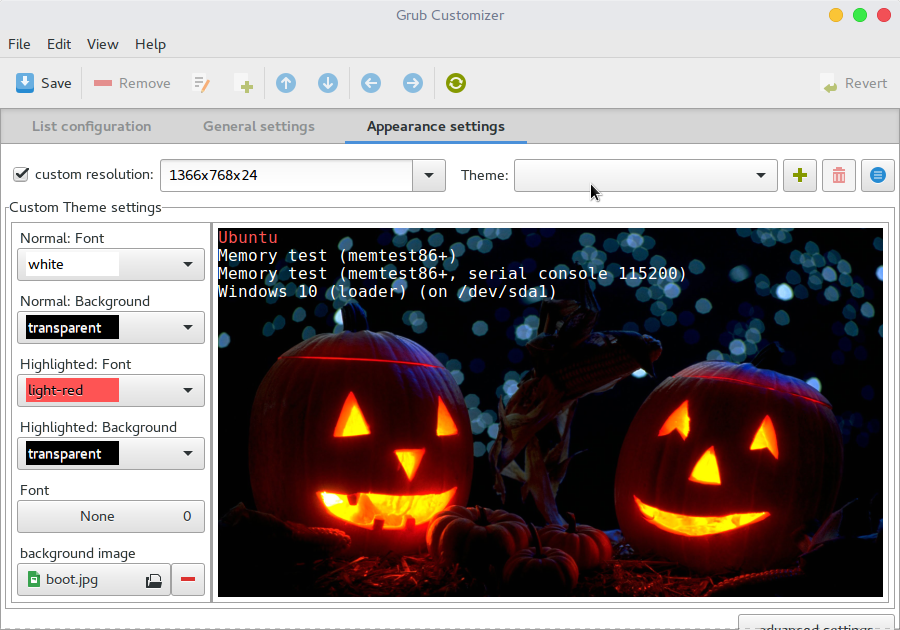

# Customizing Grub

## Grub Background

### Tools : Grub-Customizer

### STEP Customizing

#### **Step 1** - Install Grub-customizer

    sudo add-apt-repository ppa:danielrichter2007/grub-customizer
    sudo apt-get update
    sudo apt-get install grub-customizer

#### **Step 2** - Open Grub-Customizer

#### **Step 3** - Start Customize

**1**. Select Appearance Tab
**2**. Select Background Image
**3**. Custom Color
**4**. Custom Resolution

And this is my custom

**5**. And Save

#### **Step 4** - Update Grub

    sudo update-grub

#### **Step 5** - Reboot

Cloud - Cahya Putra Hikmawan.